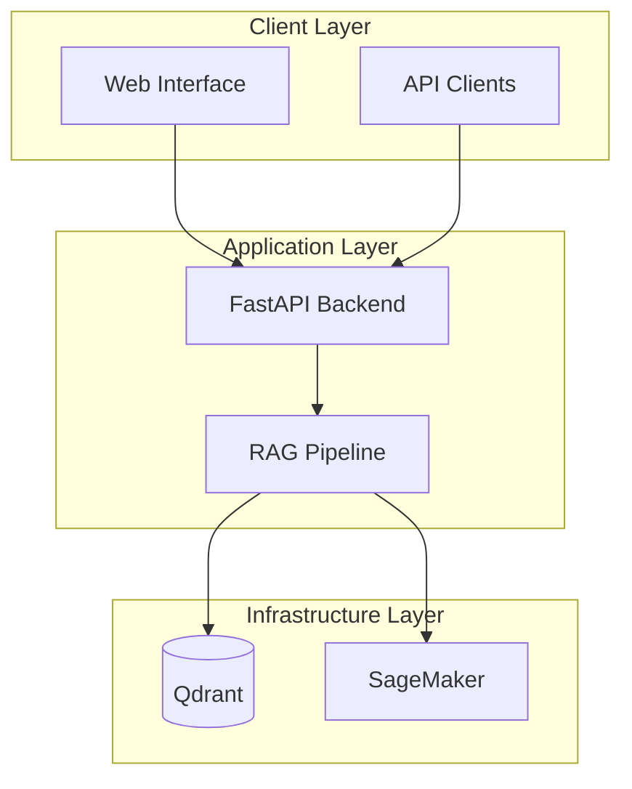

# Architecture

Technical architecture and system design of the Nigeria Tax Bill Chatbot.

---

## Overview

The system follows a **clean architecture** pattern with clear separation of concerns:

---

## Documentation Sections

-   :material-sitemap:{ .lg .middle } **System Overview**

    ---

    High-level architecture and component interactions

    [:octicons-arrow-right-24: Overview](overview.md)

-   :material-magnify:{ .lg .middle } **RAG Pipeline**

    ---

    Retrieval-Augmented Generation implementation details

    [:octicons-arrow-right-24: RAG Pipeline](rag-pipeline.md)

-   :material-brain:{ .lg .middle } **Model Training**

    ---

    Fine-tuning methodology and evaluation

    [:octicons-arrow-right-24: Training](model-training.md)

-   :material-cloud:{ .lg .middle } **Infrastructure**

    ---

    AWS services and deployment architecture

    [:octicons-arrow-right-24: Infrastructure](infrastructure.md)

---

## Key Design Decisions

| Decision | Choice | Rationale |
|----------|--------|-----------|
| Vector DB | Qdrant | Fast, cloud-hosted, free tier |
| LLM | LLaMA 3.1 8B | Open source, fine-tunable |
| Embeddings | BGE-large | High quality, 1024 dimensions |
| Hosting | AWS App Runner | Auto-scaling, easy deployment |
| Inference | SageMaker | GPU support, scale-to-zero |

---

## Quick Stats

| Component | Details |
|-----------|---------|
| Document Chunks | 291 |
| Embedding Dimensions | 1024 |
| Model Parameters | 8B |
| Training Samples | 911 |
| Avg Response Time | 3-5s |
