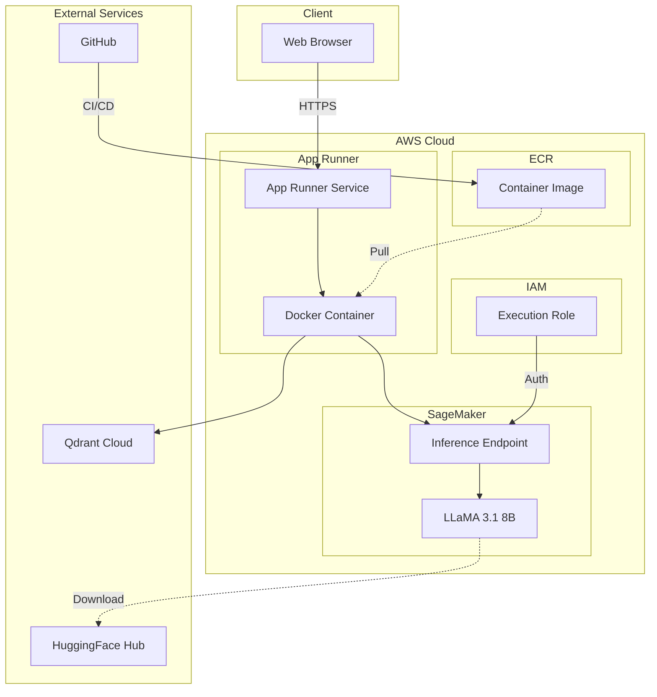
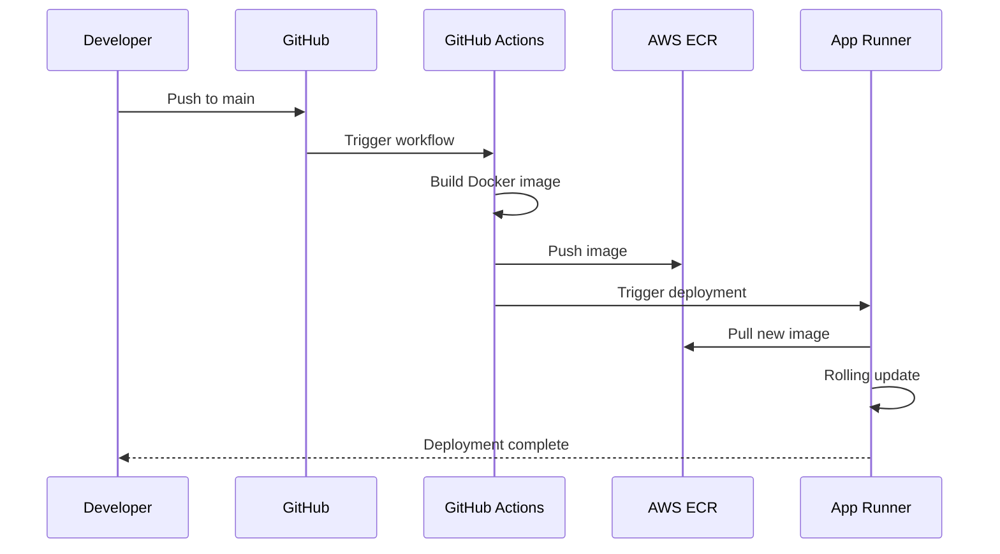

# Infrastructure

This document details the cloud infrastructure powering the Nigeria Tax Bill Chatbot.

## Architecture Diagram



---

## AWS Services

### App Runner

Hosts the FastAPI web application.

| Setting | Value |
|---------|-------|
| **vCPU** | 2 |
| **Memory** | 4 GB |
| **Port** | 8000 |
| **Min Instances** | 1 |
| **Max Instances** | 3 |
| **Auto-scaling** | Requests-based |

```yaml title="apprunner.yaml"
version: 1.0
runtime: python311
build:
  commands:
    build:
      - pip install -r requirements.txt
      - cd frontend && npm install && npm run build && cd ..
run:
  command: uvicorn main:app --host 0.0.0.0 --port 8000
  network:
    port: 8000
  env:
    - name: AWS_REGION
      value: us-east-1
```

### ECR (Elastic Container Registry)

Stores Docker images for deployment.

```bash
# Repository
nigeria-tax-chatbot

# Image URI
123456789.dkr.ecr.us-east-1.amazonaws.com/nigeria-tax-chatbot:latest
```

### SageMaker

Hosts the fine-tuned LLaMA model for inference.

| Setting | Value |
|---------|-------|
| **Endpoint Name** | nigeria-tax-llama-v3 |
| **Instance Type** | ml.g5.xlarge |
| **GPU** | NVIDIA A10G (24GB) |
| **Auto-scaling** | Scale to zero after 15 min |
| **Min Instances** | 0 |
| **Max Instances** | 1 |

```python title="SageMaker Deployment"
from sagemaker.huggingface import HuggingFaceModel

hub_config = {
    'HF_MODEL_ID': 'ocanthony4real/NigeriaTaxLlama-3.1-8B-RAG-v3',
    'HF_TOKEN': os.environ['HUGGINGFACE_TOKEN'],
    'SM_NUM_GPUS': '1'
}

model = HuggingFaceModel(
    env=hub_config,
    role=sagemaker_role,
    transformers_version='4.37.0',
    pytorch_version='2.1.0',
    py_version='py310',
)

predictor = model.deploy(
    initial_instance_count=1,
    instance_type='ml.g5.xlarge',
    endpoint_name='nigeria-tax-llama-v3'
)
```

### IAM Roles

#### SageMaker Execution Role

```json title="sagemaker_execution_role.json"
{
  "Version": "2012-10-17",
  "Statement": [
    {
      "Effect": "Allow",
      "Principal": {
        "Service": "sagemaker.amazonaws.com"
      },
      "Action": "sts:AssumeRole"
    }
  ]
}
```

#### App Runner Service Role

```json title="iam-policy.json"
{
  "Version": "2012-10-17",
  "Statement": [
    {
      "Effect": "Allow",
      "Action": [
        "sagemaker:InvokeEndpoint",
        "sagemaker:DescribeEndpoint"
      ],
      "Resource": "arn:aws:sagemaker:*:*:endpoint/nigeria-tax-*"
    },
    {
      "Effect": "Allow",
      "Action": [
        "ecr:GetAuthorizationToken",
        "ecr:BatchCheckLayerAvailability",
        "ecr:GetDownloadUrlForLayer",
        "ecr:BatchGetImage"
      ],
      "Resource": "*"
    }
  ]
}
```

---

## External Services

### Qdrant Cloud

Vector database for semantic search.

| Setting | Value |
|---------|-------|
| **Tier** | Starter (Free) |
| **Region** | AWS us-east-1 |
| **Vectors** | 291 |
| **Dimensions** | 1024 |
| **Distance** | Cosine |

```python
from qdrant_client import QdrantClient

client = QdrantClient(
    url="https://xyz.us-east-1.aws.cloud.qdrant.io",
    api_key=os.environ["QDRANT_APIKEY"]
)
```

### HuggingFace Hub

Hosts the fine-tuned model.

| Property | Value |
|----------|-------|
| **Repository** | ocanthony4real/NigeriaTaxLlama-3.1-8B-RAG-v3 |
| **Model Size** | ~16GB |
| **Format** | Safetensors |
| **License** | Llama 3.1 Community |

### MongoDB Atlas (Optional)

Document storage for logs and metadata.

| Setting | Value |
|---------|-------|
| **Tier** | M0 (Free) |
| **Region** | AWS us-east-1 |
| **Database** | tax_chatbot |

---

## CI/CD Pipeline

### GitHub Actions Workflow

```yaml title=".github/workflows/docker-ecr.yml"
name: Build and Deploy

on:
  push:
    branches: [main]
    paths:
      - 'web/**'

jobs:
  build-and-push:
    runs-on: ubuntu-latest
    steps:
      - uses: actions/checkout@v4

      - name: Configure AWS credentials
        uses: aws-actions/configure-aws-credentials@v4
        with:
          aws-access-key-id: ${{ secrets.AWS_ACCESS_KEY_ID }}
          aws-secret-access-key: ${{ secrets.AWS_SECRET_ACCESS_KEY }}
          aws-region: us-east-1

      - name: Login to Amazon ECR
        id: login-ecr
        uses: aws-actions/amazon-ecr-login@v2

      - name: Build and push image
        env:
          ECR_REGISTRY: ${{ steps.login-ecr.outputs.registry }}
          ECR_REPOSITORY: nigeria-tax-chatbot
          IMAGE_TAG: ${{ github.sha }}
        run: |
          docker build -t $ECR_REGISTRY/$ECR_REPOSITORY:$IMAGE_TAG -f web/Dockerfile web/
          docker push $ECR_REGISTRY/$ECR_REPOSITORY:$IMAGE_TAG
          docker tag $ECR_REGISTRY/$ECR_REPOSITORY:$IMAGE_TAG $ECR_REGISTRY/$ECR_REPOSITORY:latest
          docker push $ECR_REGISTRY/$ECR_REPOSITORY:latest

      - name: Update App Runner
        run: |
          aws apprunner start-deployment --service-arn ${{ secrets.APPRUNNER_SERVICE_ARN }}
```

### Deployment Flow



---

## Docker Configuration

### Dockerfile

```dockerfile title="web/Dockerfile"
# Build stage for frontend
FROM node:20-alpine AS frontend-builder
WORKDIR /app/frontend
COPY frontend/package*.json ./
RUN npm ci
COPY frontend/ ./
RUN npm run build

# Production stage
FROM python:3.11-slim

WORKDIR /app

# Install system dependencies
RUN apt-get update && apt-get install -y \
    build-essential \
    && rm -rf /var/lib/apt/lists/*

# Install Python dependencies
COPY requirements.txt .
RUN pip install --no-cache-dir -r requirements.txt

# Copy application code
COPY main.py .
COPY --from=frontend-builder /app/frontend/out ./static

# Environment
ENV PORT=8000
EXPOSE 8000

# Health check
HEALTHCHECK --interval=30s --timeout=3s \
    CMD curl -f http://localhost:8000/api/health || exit 1

# Run
CMD ["uvicorn", "main:app", "--host", "0.0.0.0", "--port", "8000"]
```

---

## Networking

### Request Flow

```
User Request
    │
    ▼
┌─────────────────┐
│   CloudFront    │  (Optional CDN)
│   (HTTPS/TLS)   │
└────────┬────────┘
         │
         ▼
┌─────────────────┐
│   App Runner    │  Public Endpoint
│   Load Balancer │
└────────┬────────┘
         │
         ▼
┌─────────────────┐
│   Container     │  FastAPI Application
│   Instance      │
└────────┬────────┘
         │
    ┌────┴────┐
    │         │
    ▼         ▼
┌───────┐  ┌────────┐
│Qdrant │  │SageMaker│
│Cloud  │  │Endpoint │
└───────┘  └────────┘
```

### Security Groups

| Service | Inbound | Outbound |
|---------|---------|----------|
| App Runner | 443 (HTTPS) | All |
| SageMaker | VPC Only | All |

---

## Monitoring

### CloudWatch Metrics

| Metric | Alert Threshold |
|--------|-----------------|
| App Runner CPU | >80% for 5 min |
| App Runner Memory | >80% for 5 min |
| SageMaker Latency | >10s p95 |
| Error Rate | >5% for 5 min |

### Health Checks

```python
@app.get("/api/health")
async def health_check():
    """Liveness probe for App Runner"""
    return {"status": "healthy"}

@app.get("/api/ready")
async def readiness_check():
    """Readiness probe - checks dependencies"""
    try:
        # Check Qdrant connection
        client.get_collections()
        return {"status": "ready"}
    except Exception:
        raise HTTPException(503, "Dependencies not ready")
```

---

## Cost Analysis

### Monthly Cost Breakdown

| Service | Configuration | Est. Cost |
|---------|---------------|-----------|
| **App Runner** | 2 vCPU, 4GB, min 1 instance | $50-80 |
| **SageMaker** | ml.g5.xlarge, scale-to-zero | $0-150 |
| **ECR** | ~5GB storage | $1-5 |
| **Qdrant Cloud** | Starter tier | $0 (free) |
| **MongoDB Atlas** | M0 tier | $0 (free) |
| **Total** | | **$51-235/month** |

### Cost Optimization

1. **SageMaker Scale-to-Zero**
   - Endpoint scales down after 15 minutes of inactivity
   - Saves ~$150/month for low-traffic periods

2. **App Runner Min Instances**
   - Set to 1 (accepts cold starts)
   - Could be 0 for even lower cost

3. **Free Tier Services**
   - Qdrant Starter: Free for small datasets
   - MongoDB M0: Free for logs/metadata

---

## Disaster Recovery

### Backup Strategy

| Component | Backup Method | Frequency |
|-----------|---------------|-----------|
| Qdrant Vectors | Snapshot API | Daily |
| Model Weights | HuggingFace Hub | On release |
| Application | Git repository | Continuous |

### Recovery Procedures

1. **App Runner Failure**
   - Automatic rollback to previous deployment
   - Manual: Redeploy from ECR image

2. **SageMaker Endpoint Failure**
   - Run deployment script to recreate endpoint
   - Model fetched from HuggingFace Hub

3. **Qdrant Data Loss**
   - Restore from snapshot
   - Or re-run embedding pipeline

---

## Next Steps

- [Docker Guide](../deployment/docker.md) - Container configuration
- [CI/CD Guide](../deployment/cicd.md) - Pipeline setup
- [Cost Optimization](../deployment/cost-optimization.md) - Reduce costs
