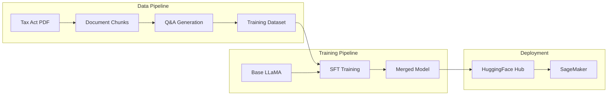

# Model Training

This document details how the LLaMA 3.1 8B model was fine-tuned for Nigerian tax law.

## Overview

The model was fine-tuned using **Supervised Fine-Tuning (SFT)** with **LoRA** (Low-Rank Adaptation) for parameter efficiency.



---

## Base Model

| Property | Value |
|----------|-------|
| **Model** | meta-llama/Llama-3.1-8B-Instruct |
| **Parameters** | 8 billion |
| **Architecture** | Decoder-only transformer |
| **Context Length** | 128K tokens |
| **License** | Llama 3.1 Community License |

---

## Dataset Generation

### Source Document

The Nigeria Tax Act 2025 was processed into training data:

```
Nigeria Tax Act 2025 (Official PDF)
├── Total Pages: ~200
├── Chapters: 15
├── Parts: 45
├── Sections: 250+
└── Output: 291 semantic chunks
```

### Q&A Generation Process

Questions and answers were generated using an LLM:

```python
def generate_qa_pairs(chunk: Chunk) -> List[QAPair]:
    """Generate Q&A pairs from a document chunk"""
    prompt = f"""Based on this excerpt from the Nigeria Tax Act 2025,
    generate 3-5 question-answer pairs.

    Rules:
    1. Questions should be what a legal professional might ask
    2. Answers must cite Section {chunk.section} (p. {chunk.page_number})
    3. Format: "According to Section X (p. Y), ..."

    Excerpt:
    {chunk.content}

    Generate Q&A pairs:"""

    return llm.generate(prompt)
```

### Dataset Statistics

| Metric | Value |
|--------|-------|
| **Total Q&A Pairs** | 911 |
| **Training Samples** | 820 (90%) |
| **Validation Samples** | 91 (10%) |
| **Avg Question Length** | 45 tokens |
| **Avg Answer Length** | 120 tokens |
| **Citation Format** | "According to Section X (p. Y), ..." |

### Dataset Format

The dataset follows the instruction-tuning format:

```python
class InstructDatasetSample(BaseModel):
    instruction: str  # The question
    context: str      # Retrieved chunk content
    response: str     # Answer with citations

# Example
{
    "instruction": "What is the VAT rate in Nigeria?",
    "context": "[Section 148 (p. 88)] The standard VAT rate...",
    "response": "According to Section 148 (p. 88), the VAT rate in Nigeria is 7.5 percent..."
}
```

---

## Fine-Tuning Configuration

### LoRA Parameters

```python
from peft import LoraConfig

lora_config = LoraConfig(
    r=16,                    # Rank
    lora_alpha=32,           # Scaling factor
    target_modules=[         # Modules to adapt
        "q_proj",
        "k_proj",
        "v_proj",
        "o_proj",
        "gate_proj",
        "up_proj",
        "down_proj"
    ],
    lora_dropout=0.1,
    bias="none",
    task_type="CAUSAL_LM"
)
```

**Why LoRA?**

| Approach | Trainable Params | Memory | Speed |
|----------|-----------------|--------|-------|
| Full fine-tune | 8B | 64GB+ | Slow |
| LoRA (r=16) | ~8M | 16GB | Fast |

LoRA trains only 0.1% of parameters while achieving similar quality.

### Training Parameters

```python
from transformers import TrainingArguments

training_args = TrainingArguments(
    output_dir="./outputs",
    num_train_epochs=3,
    per_device_train_batch_size=4,
    gradient_accumulation_steps=4,  # Effective batch size: 16
    learning_rate=2e-4,
    warmup_ratio=0.1,
    lr_scheduler_type="cosine",
    logging_steps=10,
    save_strategy="epoch",
    fp16=True,                      # Mixed precision
    optim="adamw_torch",
    max_grad_norm=1.0,
)
```

### Hardware

| Resource | Specification |
|----------|--------------|
| **Instance** | AWS SageMaker ml.g5.2xlarge |
| **GPU** | NVIDIA A10G (24GB VRAM) |
| **CPU** | 8 vCPU |
| **RAM** | 32GB |
| **Training Time** | ~2 hours |

---

## Training Pipeline

### Using Unsloth (Fast Training)

```python
from unsloth import FastLanguageModel

# Load base model with 4-bit quantization
model, tokenizer = FastLanguageModel.from_pretrained(
    model_name="meta-llama/Llama-3.1-8B-Instruct",
    max_seq_length=4096,
    dtype=None,  # Auto-detect
    load_in_4bit=True
)

# Add LoRA adapters
model = FastLanguageModel.get_peft_model(
    model,
    r=16,
    lora_alpha=32,
    lora_dropout=0.1,
    target_modules=[
        "q_proj", "k_proj", "v_proj", "o_proj",
        "gate_proj", "up_proj", "down_proj"
    ],
)
```

### SFT Training

```python
from trl import SFTTrainer

trainer = SFTTrainer(
    model=model,
    tokenizer=tokenizer,
    train_dataset=train_dataset,
    eval_dataset=val_dataset,
    dataset_text_field="text",
    max_seq_length=4096,
    args=training_args,
)

# Train
trainer.train()

# Save LoRA weights
model.save_pretrained("./lora_weights")
```

### Merging and Uploading

```python
# Merge LoRA weights into base model
merged_model = model.merge_and_unload()

# Upload to HuggingFace Hub
merged_model.push_to_hub(
    "ocanthony4real/NigeriaTaxLlama-3.1-8B-RAG-v3",
    token=os.environ["HUGGINGFACE_TOKEN"]
)
tokenizer.push_to_hub(
    "ocanthony4real/NigeriaTaxLlama-3.1-8B-RAG-v3",
    token=os.environ["HUGGINGFACE_TOKEN"]
)
```

---

## Training Metrics

### Loss Curve

```
Epoch 1: train_loss=1.82, eval_loss=1.45
Epoch 2: train_loss=1.21, eval_loss=1.18
Epoch 3: train_loss=0.89, eval_loss=1.12
```

### Convergence

The model converged after 3 epochs with stable validation loss.

---

## Model Evaluation

### Evaluation Method

The fine-tuned model was evaluated using Claude 3 Haiku as a judge:

```python
EVALUATION_PROMPT = """
Rate this tax law Q&A response on two criteria:

1. ACCURACY (1-3): Does the answer correctly cite and explain the law?
2. STYLE (1-3): Is the response professional and well-formatted?

Question: {question}
Expected: {expected_answer}
Model Response: {model_response}

Provide scores as: ACCURACY: X, STYLE: Y
"""
```

### Results

| Metric | Score | Description |
|--------|-------|-------------|
| **Accuracy** | 93.3% (2.8/3) | Correct citations and content |
| **Style** | 96.7% (2.9/3) | Professional formatting |
| **Hallucination Rate** | <5% | Made-up information |
| **Citation Accuracy** | 92% | Correct section references |

### Sample Evaluations

**High-Scoring Example:**

```
Q: What is the corporate income tax rate?
Expected: "According to Section 23 (p. 15), the corporate tax rate is 30%..."
Model: "According to Section 23 (p. 15), the corporate income tax rate in Nigeria is 30%..."
Accuracy: 3/3, Style: 3/3
```

**Lower-Scoring Example:**

```
Q: What are VAT exemptions for exports?
Expected: "According to Section 151 (p. 91), exports are zero-rated..."
Model: "Exports are exempt from VAT under Nigerian tax law."
Accuracy: 2/3 (missing citation), Style: 3/3
```

---

## Training Configuration Files

### ZenML Pipeline

```yaml title="configs/training.yaml"
parameters:
  # Model settings
  model:
    base_model: "meta-llama/Llama-3.1-8B-Instruct"
    max_seq_length: 4096

  # LoRA settings
  lora:
    r: 16
    alpha: 32
    dropout: 0.1

  # Training settings
  training:
    num_epochs: 3
    batch_size: 4
    gradient_accumulation: 4
    learning_rate: 2e-4
    warmup_ratio: 0.1
    fp16: true

  # Output settings
  output:
    hub_model_id: "ocanthony4real/NigeriaTaxLlama-3.1-8B-RAG-v3"
    hub_workspace: "ocanthony4real"
```

---

## Key Learnings

### What Worked

1. **Citation Format in Training Data**
   - Teaching "According to Section X (p. Y)" during training was crucial
   - Model learned to cite consistently

2. **LoRA Efficiency**
   - Training completed in 2 hours vs 20+ hours for full fine-tune
   - Quality comparable to full fine-tuning

3. **Domain-Specific Data**
   - 911 curated Q&A pairs outperformed generic legal data
   - Quality > Quantity

### What Didn't Work

1. **Lower LoRA Rank (r=8)**
   - Insufficient capacity for legal terminology
   - Upgraded to r=16

2. **Single Epoch**
   - Model underfit, poor citation accuracy
   - 3 epochs optimal

3. **Higher Temperature During Training**
   - Led to inconsistent outputs
   - Kept temperature at 0.7

---

## Reproduction Steps

To reproduce the training:

```bash
# 1. Generate dataset
python tools/run.py --pipeline generate_datasets \
  --config configs/generate_instruct_datasets.yaml

# 2. Run training
python tools/run.py --pipeline training \
  --config configs/training.yaml

# 3. Evaluate
python tools/run.py --pipeline evaluating \
  --config configs/evaluating.yaml
```

---

## Next Steps

- [Infrastructure](infrastructure.md) - Deploy the trained model
- [Model Performance](../evaluation/model-performance.md) - Detailed evaluation results
