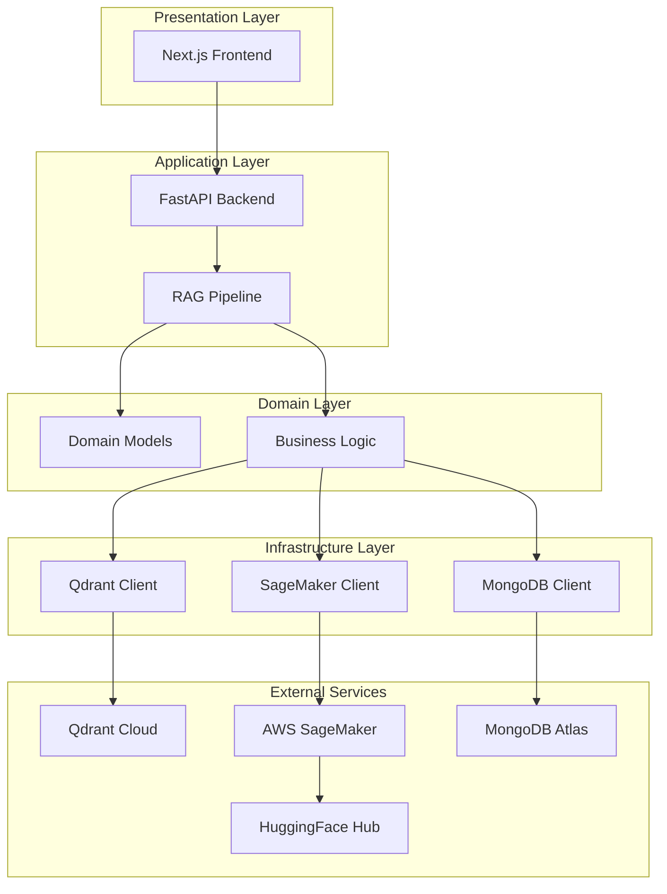
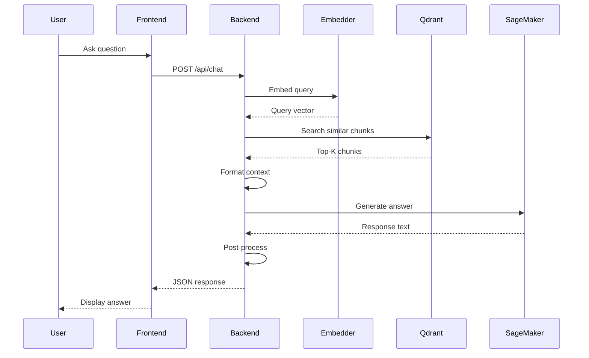
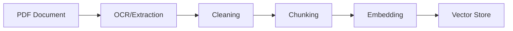
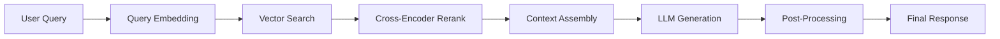
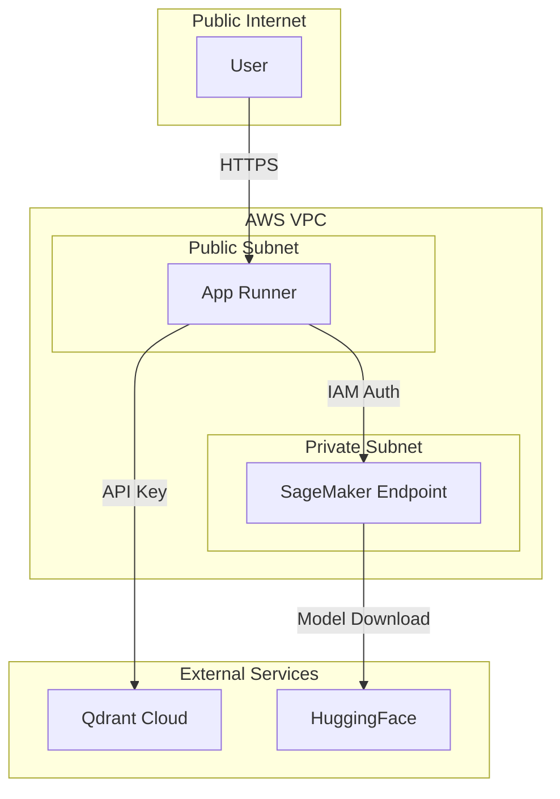

# Architecture Overview

This document provides a comprehensive overview of the Nigeria Tax Bill Chatbot architecture.

## System Architecture

The system follows a **clean architecture** pattern with clear separation of concerns:



---

## High-Level Flow



---

## Layer Descriptions

### 1. Presentation Layer

The frontend provides a modern chat interface built with:

- **Next.js 14** - React framework with App Router
- **Tailwind CSS** - Utility-first styling
- **TypeScript** - Type safety

Key features:
- Real-time chat interface
- Source citation display
- Responsive design
- Dark/light mode support

### 2. Application Layer

The backend orchestrates all operations:

```
┌─────────────────────────────────────────────────────────────────┐
│                        FastAPI Application                       │
│                                                                  │
│  ┌──────────────┐  ┌──────────────┐  ┌──────────────────────┐  │
│  │   /api/chat  │  │ /api/health  │  │   Static Files       │  │
│  │              │  │              │  │   (Next.js build)    │  │
│  └──────┬───────┘  └──────────────┘  └──────────────────────┘  │
│         │                                                        │
│         ▼                                                        │
│  ┌──────────────────────────────────────────────────────────┐   │
│  │                     RAG Pipeline                          │   │
│  │                                                           │   │
│  │  ┌─────────┐  ┌─────────┐  ┌─────────┐  ┌─────────────┐  │   │
│  │  │  Embed  │─▶│ Search  │─▶│ Rerank  │─▶│  Generate   │  │   │
│  │  └─────────┘  └─────────┘  └─────────┘  └─────────────┘  │   │
│  └──────────────────────────────────────────────────────────┘   │
└─────────────────────────────────────────────────────────────────┘
```

### 3. Domain Layer

Contains business logic and domain models:

| Model | Purpose | Location |
|-------|---------|----------|
| `TaxBillChunk` | Document chunk with metadata | `domain/chunks.py` |
| `TaxBillEmbeddedChunk` | Chunk with vector embedding | `domain/embedded_chunks.py` |
| `InstructDatasetSample` | Training data format | `domain/dataset.py` |
| `Query` | Search query model | `domain/queries.py` |

### 4. Infrastructure Layer

Handles external service integrations:

```python
# Database Clients
class QdrantClient:
    """Vector database operations"""

class MongoClient:
    """Document storage operations"""

# ML Clients
class SageMakerClient:
    """Model inference operations"""

class EmbeddingModel:
    """Text-to-vector conversion"""
```

---

## Data Flow

### Document Processing Pipeline



**Stages:**

1. **PDF Extraction** - PDFMiner-six extracts text; Tesseract OCR handles scanned pages
2. **Cleaning** - Remove noise, normalize whitespace, fix encoding
3. **Chunking** - Split into semantic chunks preserving legal hierarchy
4. **Embedding** - Convert text to 1024-dimensional vectors
5. **Storage** - Store in Qdrant with metadata

### Inference Pipeline



---

## Component Interactions

### Request Handling

```python
@app.post("/api/chat")
async def chat(request: ChatRequest) -> ChatResponse:
    # 1. Embed the query
    query_vector = embedding_model.encode(request.query)

    # 2. Search Qdrant for similar chunks
    results = qdrant_client.search(
        collection_name="tax_bill_chunks",
        query_vector=query_vector,
        limit=request.k
    )

    # 3. Format context with section references
    context = format_context(results)

    # 4. Generate answer using SageMaker
    answer = sagemaker_client.invoke(
        prompt=build_prompt(request.query, context)
    )

    # 5. Post-process and return
    return ChatResponse(
        answer=post_process(answer),
        references=extract_references(results),
        sources=format_sources(results)
    )
```

### Lazy Loading Pattern

Components are loaded on first use to optimize cold starts:

```python
class LazyLoader:
    _embedding_model = None
    _qdrant_client = None
    _sagemaker_client = None

    @property
    def embedding_model(self):
        if self._embedding_model is None:
            self._embedding_model = SentenceTransformer(MODEL_ID)
        return self._embedding_model
```

---

## Scalability Considerations

### Horizontal Scaling

| Component | Scaling Strategy |
|-----------|-----------------|
| Frontend | App Runner auto-scaling |
| Backend | App Runner instances |
| Vector DB | Qdrant Cloud managed |
| LLM | SageMaker auto-scaling |

### Performance Optimizations

1. **Connection Pooling** - Reuse database connections
2. **Caching** - Cache embedding model in memory
3. **Batch Processing** - Batch embedding requests
4. **Async Operations** - Non-blocking I/O

---

## Security Architecture



**Security Measures:**

- HTTPS everywhere
- IAM-based authentication for AWS services
- API key authentication for Qdrant
- No secrets in code (environment variables)
- CORS configuration

---

## Error Handling

The system implements graceful degradation:

```python
try:
    # Primary path: SageMaker inference
    answer = sagemaker_client.invoke(prompt)
except EndpointNotFound:
    # Fallback: Return context without generation
    answer = "The endpoint is warming up. Please try again."
except Exception as e:
    logger.error(f"Inference failed: {e}")
    raise HTTPException(status_code=500, detail="Internal error")
```

---

## Monitoring & Observability

### Logging

```python
from loguru import logger

logger.info("Query received", query=request.query)
logger.debug("Retrieved chunks", count=len(results))
logger.error("SageMaker error", error=str(e))
```

### Metrics

Key metrics tracked:

- Request latency
- Embedding time
- Search time
- Generation time
- Error rates

### Health Checks

```python
@app.get("/api/health")
async def health():
    return {"status": "healthy"}
```

---

## Next Steps

- [RAG Pipeline](rag-pipeline.md) - Deep dive into retrieval augmented generation
- [Model Training](model-training.md) - How the model was fine-tuned
- [Infrastructure](infrastructure.md) - AWS and cloud setup
