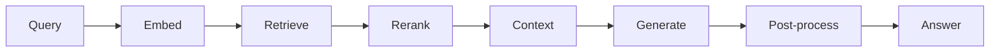

# RAG Pipeline

The Retrieval-Augmented Generation (RAG) pipeline is the core of the Nigeria Tax Bill Chatbot. This document explains how it works in detail.

## Overview

RAG combines the best of both worlds:

- **Retrieval** - Find relevant information from a knowledge base
- **Generation** - Use an LLM to synthesize a coherent answer



---

## Pipeline Components

### 1. Query Embedding

The user's question is converted to a dense vector representation:

```python
from sentence_transformers import SentenceTransformer

class QueryEmbedder:
    def __init__(self):
        self.model = SentenceTransformer("BAAI/bge-large-en-v1.5")

    def embed(self, query: str) -> List[float]:
        # BGE models expect this prefix for queries
        prefixed_query = f"Represent this sentence for searching: {query}"
        return self.model.encode(prefixed_query).tolist()
```

**Model Details:**

| Property | Value |
|----------|-------|
| Model | BAAI/bge-large-en-v1.5 |
| Dimensions | 1024 |
| Max Tokens | 512 |
| Language | English |

### 2. Vector Search

The query vector is used to find similar document chunks:

```python
from qdrant_client import QdrantClient

class TaxBillRetriever:
    def __init__(self):
        self.client = QdrantClient(
            url=settings.QDRANT_CLOUD_URL,
            api_key=settings.QDRANT_APIKEY
        )

    def search(self, query_vector: List[float], k: int = 10) -> List[Chunk]:
        results = self.client.search(
            collection_name="tax_bill_chunks",
            query_vector=query_vector,
            limit=k,
            with_payload=True
        )
        return [self._to_chunk(r) for r in results]
```

**Collection Schema:**

```json
{
  "collection_name": "tax_bill_chunks",
  "vectors": {
    "size": 1024,
    "distance": "Cosine"
  },
  "payload_schema": {
    "content": "text",
    "section": "keyword",
    "page_number": "integer",
    "chapter": "keyword",
    "part": "keyword"
  }
}
```

### 3. Reranking

A cross-encoder model reorders results for better relevance:

```python
from sentence_transformers import CrossEncoder

class Reranker:
    def __init__(self):
        self.model = CrossEncoder("cross-encoder/ms-marco-MiniLM-L-4-v2")

    def rerank(self, query: str, chunks: List[Chunk], top_k: int = 5) -> List[Chunk]:
        # Create query-document pairs
        pairs = [(query, chunk.content) for chunk in chunks]

        # Score each pair
        scores = self.model.predict(pairs)

        # Sort by score and return top-k
        ranked = sorted(zip(chunks, scores), key=lambda x: x[1], reverse=True)
        return [chunk for chunk, score in ranked[:top_k]]
```

**Why Reranking?**

| Approach | Speed | Accuracy |
|----------|-------|----------|
| Vector search only | Fast | Good |
| Vector + Rerank | Slower | Better |

Reranking uses a cross-encoder that sees both query and document together, enabling more nuanced relevance judgments.

### 4. Context Formatting

Retrieved chunks are formatted into a prompt-ready context:

```python
def format_context(chunks: List[Chunk], max_length: int = 6000) -> str:
    context_parts = []

    for chunk in chunks:
        # Format with section reference
        reference = f"[Section {chunk.section} (p. {chunk.page_number})]"
        formatted = f"{reference}\n{chunk.content}"
        context_parts.append(formatted)

    # Join and truncate if needed
    full_context = "\n\n".join(context_parts)
    return full_context[:max_length]
```

**Example Context:**

```
[Section 148 (p. 88)]
The standard VAT rate applicable to all taxable supplies in Nigeria shall be
7.5 percent (7.5%) of the value of the taxable supplies...

[Section 149 (p. 89)]
The following goods and services shall be exempt from VAT:
(a) Medical and pharmaceutical products
(b) Basic food items
...
```

### 5. Prompt Construction

The prompt combines the query with retrieved context:

```python
TAX_BILL_PROMPT = """You are a Nigerian tax law expert assistant. Answer questions
accurately based ONLY on the provided context from the Nigeria Tax Act 2025.

IMPORTANT RULES:
1. Only use information from the provided context
2. Always cite the specific Section and page number
3. If the information is not in the context, say "I don't have information about that"
4. Use the format "According to Section X (p. Y), ..."

### Context:
{context}

### Question:
{query}

### Response:"""

def build_prompt(query: str, context: str) -> str:
    return TAX_BILL_PROMPT.format(query=query, context=context)
```

### 6. LLM Generation

The fine-tuned LLaMA model generates the answer:

```python
import boto3

class SageMakerInference:
    def __init__(self):
        self.client = boto3.client(
            "sagemaker-runtime",
            region_name=settings.AWS_REGION,
            aws_access_key_id=settings.AWS_ACCESS_KEY,
            aws_secret_access_key=settings.AWS_SECRET_KEY
        )

    def generate(self, prompt: str) -> str:
        payload = {
            "inputs": prompt,
            "parameters": {
                "max_new_tokens": 1024,
                "temperature": 0.7,
                "top_p": 0.9,
                "do_sample": True
            }
        }

        response = self.client.invoke_endpoint(
            EndpointName=settings.SAGEMAKER_ENDPOINT_INFERENCE,
            ContentType="application/json",
            Body=json.dumps(payload)
        )

        result = json.loads(response["Body"].read().decode())
        return result[0]["generated_text"]
```

**Generation Parameters:**

| Parameter | Value | Purpose |
|-----------|-------|---------|
| `max_new_tokens` | 1024 | Maximum response length |
| `temperature` | 0.7 | Creativity (0=deterministic, 1=creative) |
| `top_p` | 0.9 | Nucleus sampling threshold |
| `do_sample` | True | Enable sampling |

### 7. Post-Processing

The raw response is cleaned and validated:

```python
import re

def post_process(response: str, chunks: List[Chunk]) -> str:
    # Extract text after "### Response:" marker
    if "### Response:" in response:
        response = response.split("### Response:")[-1].strip()

    # Fix "Section N/A" patterns
    response = fix_section_references(response, chunks)

    # Remove any remaining prompt artifacts
    response = response.replace("### Context:", "").strip()

    return response

def fix_section_references(text: str, chunks: List[Chunk]) -> str:
    """Replace N/A section references with actual section numbers"""
    # Pattern: "Section N/A" or "section n/a"
    pattern = r'[Ss]ection\s+N/?A'

    # Get actual section numbers from chunks
    sections = [c.section for c in chunks if c.section]

    if sections and re.search(pattern, text):
        # Replace with first available section
        text = re.sub(pattern, f"Section {sections[0]}", text)

    return text
```

---

## Complete Pipeline Flow

```python
class RAGPipeline:
    def __init__(self):
        self.embedder = QueryEmbedder()
        self.retriever = TaxBillRetriever()
        self.reranker = Reranker()
        self.generator = SageMakerInference()

    def run(self, query: str, k: int = 5) -> dict:
        # Step 1: Embed query
        query_vector = self.embedder.embed(query)

        # Step 2: Retrieve candidates (fetch more for reranking)
        candidates = self.retriever.search(query_vector, k=k*2)

        # Step 3: Rerank to top-k
        ranked_chunks = self.reranker.rerank(query, candidates, top_k=k)

        # Step 4: Format context
        context = format_context(ranked_chunks)

        # Step 5: Build prompt
        prompt = build_prompt(query, context)

        # Step 6: Generate answer
        raw_answer = self.generator.generate(prompt)

        # Step 7: Post-process
        answer = post_process(raw_answer, ranked_chunks)

        return {
            "answer": answer,
            "references": extract_references(ranked_chunks),
            "sources": format_sources(ranked_chunks)
        }
```

---

## Performance Optimizations

### 1. Lazy Loading

Models are loaded only when first needed:

```python
_embedding_model = None

def get_embedding_model():
    global _embedding_model
    if _embedding_model is None:
        _embedding_model = SentenceTransformer(MODEL_ID)
    return _embedding_model
```

### 2. Connection Pooling

Reuse database connections:

```python
_qdrant_client = None

def get_qdrant_client():
    global _qdrant_client
    if _qdrant_client is None:
        _qdrant_client = QdrantClient(
            url=settings.QDRANT_CLOUD_URL,
            api_key=settings.QDRANT_APIKEY
        )
    return _qdrant_client
```

### 3. Context Truncation

Limit context size to prevent token overflow:

```python
MAX_CONTEXT_LENGTH = 6000  # Characters

def format_context(chunks, max_length=MAX_CONTEXT_LENGTH):
    context = ""
    for chunk in chunks:
        addition = f"\n\n{format_chunk(chunk)}"
        if len(context) + len(addition) > max_length:
            break
        context += addition
    return context
```

---

## Error Handling

The pipeline handles various failure modes:

```python
async def chat(request: ChatRequest) -> ChatResponse:
    try:
        result = pipeline.run(request.query, request.k)
        return ChatResponse(**result)

    except QdrantConnectionError:
        logger.error("Qdrant connection failed")
        raise HTTPException(503, "Vector database unavailable")

    except SageMakerEndpointError as e:
        if "endpoint is scaling" in str(e):
            raise HTTPException(503, "Model is warming up, please retry")
        raise HTTPException(500, "Model inference failed")

    except Exception as e:
        logger.exception("Unexpected error in RAG pipeline")
        raise HTTPException(500, "Internal server error")
```

---

## Metrics & Monitoring

Key metrics to track:

| Metric | Target | Purpose |
|--------|--------|---------|
| Embedding latency | <100ms | Query vectorization speed |
| Search latency | <200ms | Qdrant query time |
| Rerank latency | <300ms | Cross-encoder scoring |
| Generation latency | <3s | LLM response time |
| End-to-end latency | <5s | Total user wait time |

---

## Configuration

RAG pipeline settings in `llm_engineering/settings.py`:

```python
# Retrieval settings
RAG_TOP_K: int = 5
RAG_CANDIDATES_MULTIPLIER: int = 2

# Generation settings
RAG_TEMPERATURE: float = 0.7
RAG_MAX_TOKENS: int = 1024
RAG_TOP_P: float = 0.9

# Context settings
RAG_CONTEXT_MAX_LENGTH: int = 6000
```

---

## Next Steps

- [Model Training](model-training.md) - How the LLM was fine-tuned
- [Infrastructure](infrastructure.md) - Deployment architecture
