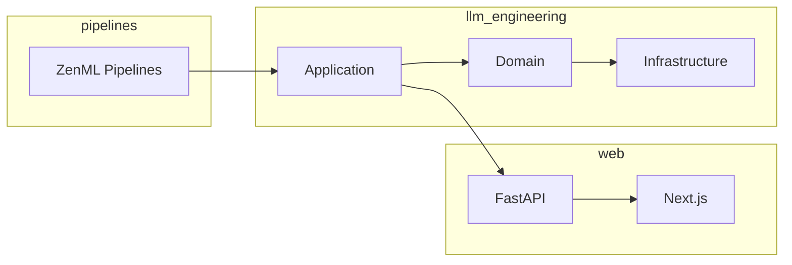

# Components

Detailed documentation for each component of the Nigeria Tax Bill Chatbot.

---

## Component Overview



---

## Documentation Sections

<div class="grid cards" markdown>

-   :material-package-variant:{ .lg .middle } **LLM Engineering**

    ---

    Core ML/AI module with RAG, embeddings, and preprocessing

    [:octicons-arrow-right-24: LLM Engineering](llm-engineering.md)

-   :material-web:{ .lg .middle } **Web Application**

    ---

    FastAPI backend and Next.js frontend

    [:octicons-arrow-right-24: Web App](web-application.md)

-   :material-pipe:{ .lg .middle } **ML Pipelines**

    ---

    ZenML orchestrated training and processing pipelines

    [:octicons-arrow-right-24: Pipelines](ml-pipelines.md)

-   :material-database:{ .lg .middle } **Domain Models**

    ---

    Core data structures and entities

    [:octicons-arrow-right-24: Models](domain-models.md)

</div>

---

## Directory Structure

```
├── llm_engineering/      # Core ML module
│   ├── application/      # Business logic
│   ├── domain/           # Data models
│   ├── infrastructure/   # External services
│   └── model/            # Model code
│
├── web/                  # Web application
│   ├── main.py           # FastAPI app
│   └── frontend/         # Next.js app
│
├── pipelines/            # ML pipelines
│   ├── feature_engineering.py
│   ├── training.py
│   └── evaluating.py
│
└── tools/                # Utility scripts
```
