# ML Pipelines

The project uses ZenML for orchestrating machine learning pipelines.

## Overview

```
pipelines/
├── __init__.py
├── feature_engineering.py    # Document processing
├── training.py               # Model fine-tuning
├── generate_datasets.py      # Q&A dataset generation
├── pdf_data_etl.py           # PDF extraction
├── evaluating.py             # Model evaluation
└── end_to_end.py             # Complete pipeline
```

---

## Pipeline Architecture

```mermaid
flowchart LR
    subgraph ETL
        PDF[PDF Document] --> Extract[Extract Text]
    end

    subgraph Feature Engineering
        Extract --> Clean[Clean Text]
        Clean --> Chunk[Create Chunks]
        Chunk --> Embed[Generate Embeddings]
        Embed --> Store[Store in Qdrant]
    end

    subgraph Dataset Generation
        Store --> Generate[Generate Q&A]
        Generate --> Split[Train/Val Split]
        Split --> Upload[Upload to HF]
    end

    subgraph Training
        Upload --> Load[Load Dataset]
        Load --> Train[Fine-tune LLaMA]
        Train --> Push[Push to Hub]
    end

    subgraph Evaluation
        Push --> Evaluate[Evaluate Model]
        Evaluate --> Report[Generate Report]
    end
```



---

## Feature Engineering Pipeline

Processes PDF documents into embedded chunks.

```python title="pipelines/feature_engineering.py"
from zenml import pipeline
from steps.feature_engineering import (
    extract_pdf_step,
    clean_documents_step,
    chunk_documents_step,
    embed_chunks_step,
    store_embeddings_step
)

@pipeline(name="feature_engineering")
def feature_engineering_pipeline(
    pdf_path: str,
    chunk_size: int = 1000,
    chunk_overlap: int = 200
):
    """
    Process PDF into embedded chunks.

    Steps:
    1. Extract text from PDF
    2. Clean and normalize text
    3. Split into semantic chunks
    4. Generate embeddings
    5. Store in Qdrant
    """
    # Extract
    raw_documents = extract_pdf_step(pdf_path)

    # Clean
    cleaned_documents = clean_documents_step(raw_documents)

    # Chunk
    chunks = chunk_documents_step(
        cleaned_documents,
        chunk_size=chunk_size,
        overlap=chunk_overlap
    )

    # Embed
    embedded_chunks = embed_chunks_step(chunks)

    # Store
    store_embeddings_step(embedded_chunks)
```

### Configuration

```yaml title="configs/feature_engineering.yaml"
parameters:
  pdf_path: "data/pdfs/Nigeria-Tax-Act-2025.pdf"
  chunk_size: 1000
  chunk_overlap: 200

settings:
  docker:
    requirements:
      - pdfminer.six
      - pytesseract
      - sentence-transformers
```

### Running

```bash
python tools/run.py --pipeline feature_engineering \
  --config configs/feature_engineering.yaml
```

---

## Dataset Generation Pipeline

Generates Q&A pairs from document chunks.

```python title="pipelines/generate_datasets.py"
from zenml import pipeline
from steps.generate_datasets import (
    load_chunks_step,
    generate_qa_pairs_step,
    format_dataset_step,
    split_dataset_step,
    upload_dataset_step
)

@pipeline(name="generate_datasets")
def generate_datasets_pipeline(
    collection_name: str = "tax_bill_chunks",
    samples_per_chunk: int = 3
):
    """
    Generate instruction-tuning dataset.

    Steps:
    1. Load chunks from Qdrant
    2. Generate Q&A pairs using LLM
    3. Format into instruction format
    4. Split train/validation
    5. Upload to HuggingFace
    """
    # Load
    chunks = load_chunks_step(collection_name)

    # Generate
    qa_pairs = generate_qa_pairs_step(
        chunks,
        samples_per_chunk=samples_per_chunk
    )

    # Format
    dataset = format_dataset_step(qa_pairs)

    # Split
    train_dataset, val_dataset = split_dataset_step(
        dataset,
        val_ratio=0.1
    )

    # Upload
    upload_dataset_step(train_dataset, val_dataset)
```

### Q&A Generation Step

```python title="steps/generate_datasets/generate_qa.py"
from zenml import step

@step
def generate_qa_pairs_step(
    chunks: List[Chunk],
    samples_per_chunk: int = 3
) -> List[QAPair]:
    """Generate Q&A pairs from chunks using LLM"""

    qa_pairs = []

    for chunk in chunks:
        prompt = f"""Based on this excerpt from the Nigeria Tax Act 2025,
        generate {samples_per_chunk} question-answer pairs.

        Rules:
        1. Questions should be what a legal professional might ask
        2. Answers must cite Section {chunk.section} (p. {chunk.page_number})
        3. Format answers as "According to Section X (p. Y), ..."

        Excerpt:
        {chunk.content}

        Generate Q&A pairs in JSON format:"""

        response = llm.generate(prompt)
        pairs = parse_qa_response(response)
        qa_pairs.extend(pairs)

    return qa_pairs
```

---

## Training Pipeline

Fine-tunes the LLaMA model.

```python title="pipelines/training.py"
from zenml import pipeline
from steps.training import (
    load_dataset_step,
    prepare_model_step,
    train_model_step,
    merge_model_step,
    push_to_hub_step
)

@pipeline(name="training")
def training_pipeline(
    dataset_id: str,
    base_model: str = "meta-llama/Llama-3.1-8B-Instruct",
    num_epochs: int = 3,
    learning_rate: float = 2e-4
):
    """
    Fine-tune LLaMA model.

    Steps:
    1. Load dataset from HuggingFace
    2. Prepare model with LoRA
    3. Train with SFT
    4. Merge LoRA weights
    5. Push to HuggingFace Hub
    """
    # Load
    dataset = load_dataset_step(dataset_id)

    # Prepare
    model, tokenizer = prepare_model_step(base_model)

    # Train
    trained_model = train_model_step(
        model,
        tokenizer,
        dataset,
        num_epochs=num_epochs,
        learning_rate=learning_rate
    )

    # Merge
    merged_model = merge_model_step(trained_model)

    # Push
    push_to_hub_step(merged_model, tokenizer)
```

### Training Step

```python title="steps/training/train.py"
from zenml import step
from unsloth import FastLanguageModel
from trl import SFTTrainer

@step
def train_model_step(
    model,
    tokenizer,
    dataset,
    num_epochs: int = 3,
    learning_rate: float = 2e-4
) -> Any:
    """Fine-tune model with SFT"""

    training_args = TrainingArguments(
        output_dir="./outputs",
        num_train_epochs=num_epochs,
        per_device_train_batch_size=4,
        gradient_accumulation_steps=4,
        learning_rate=learning_rate,
        warmup_ratio=0.1,
        lr_scheduler_type="cosine",
        fp16=True,
        logging_steps=10,
        save_strategy="epoch"
    )

    trainer = SFTTrainer(
        model=model,
        tokenizer=tokenizer,
        train_dataset=dataset,
        args=training_args,
        dataset_text_field="text",
        max_seq_length=4096
    )

    trainer.train()

    return model
```

---

## Evaluation Pipeline

Evaluates model performance.

```python title="pipelines/evaluating.py"
from zenml import pipeline
from steps.evaluating import (
    load_test_dataset_step,
    run_inference_step,
    evaluate_with_judge_step,
    generate_report_step
)

@pipeline(name="evaluating")
def evaluating_pipeline(
    model_id: str,
    test_dataset_id: str
):
    """
    Evaluate fine-tuned model.

    Steps:
    1. Load test dataset
    2. Run inference on test samples
    3. Evaluate using LLM judge
    4. Generate evaluation report
    """
    # Load
    test_data = load_test_dataset_step(test_dataset_id)

    # Inference
    predictions = run_inference_step(model_id, test_data)

    # Evaluate
    scores = evaluate_with_judge_step(test_data, predictions)

    # Report
    generate_report_step(scores)
```

### LLM Judge Evaluation

```python title="steps/evaluating/judge.py"
@step
def evaluate_with_judge_step(
    test_data: List[Sample],
    predictions: List[str]
) -> List[Score]:
    """Evaluate using Claude as judge"""

    scores = []

    for sample, prediction in zip(test_data, predictions):
        prompt = f"""Rate this tax law Q&A response:

        Question: {sample.question}
        Expected: {sample.expected_answer}
        Model Response: {prediction}

        Rate on two criteria (1-3 each):
        1. ACCURACY: Correct citations and content
        2. STYLE: Professional formatting

        Respond with: ACCURACY: X, STYLE: Y"""

        response = claude.generate(prompt)
        score = parse_scores(response)
        scores.append(score)

    return scores
```

---

## End-to-End Pipeline

Runs all pipelines in sequence.

```python title="pipelines/end_to_end.py"
from zenml import pipeline

@pipeline(name="end_to_end")
def end_to_end_pipeline():
    """
    Complete pipeline from PDF to deployed model.
    """
    # Feature engineering
    feature_engineering_pipeline()

    # Dataset generation
    generate_datasets_pipeline()

    # Training
    training_pipeline()

    # Evaluation
    evaluating_pipeline()
```

---

## Pipeline Steps

### Step Directory Structure

```
steps/
├── __init__.py
├── etl/
│   ├── extract_pdf.py
│   └── load_data.py
├── feature_engineering/
│   ├── clean.py
│   ├── chunk.py
│   └── embed.py
├── generate_datasets/
│   ├── generate_qa.py
│   └── format.py
├── training/
│   ├── prepare.py
│   └── train.py
└── evaluating/
    ├── inference.py
    └── judge.py
```

### Example Step

```python title="steps/feature_engineering/chunk.py"
from zenml import step
from typing import List

@step
def chunk_documents_step(
    documents: List[Document],
    chunk_size: int = 1000,
    overlap: int = 200
) -> List[Chunk]:
    """Split documents into semantic chunks"""

    from langchain.text_splitter import RecursiveCharacterTextSplitter

    splitter = RecursiveCharacterTextSplitter(
        chunk_size=chunk_size,
        chunk_overlap=overlap,
        separators=["\n\n", "\n", ". ", " "]
    )

    chunks = []
    for doc in documents:
        texts = splitter.split_text(doc.content)
        for i, text in enumerate(texts):
            chunks.append(Chunk(
                content=text,
                document_id=doc.id,
                chunk_index=i,
                metadata=doc.metadata
            ))

    return chunks
```

---

## Running Pipelines

### Using the CLI Tool

```bash
# Feature engineering
python tools/run.py --pipeline feature_engineering \
  --config configs/feature_engineering.yaml

# Generate datasets
python tools/run.py --pipeline generate_datasets \
  --config configs/generate_instruct_datasets.yaml

# Training
python tools/run.py --pipeline training \
  --config configs/training.yaml

# Evaluation
python tools/run.py --pipeline evaluating \
  --config configs/evaluating.yaml

# End-to-end
python tools/run.py --pipeline end_to_end \
  --config configs/end_to_end.yaml
```

### Without ZenML

If ZenML is not installed, pipelines gracefully degrade to simple Python execution:

```python
# Standalone execution
from pipelines.feature_engineering import feature_engineering_pipeline

feature_engineering_pipeline(
    pdf_path="data/pdfs/Nigeria-Tax-Act-2025.pdf"
)
```

---

## Configuration Files

### Training Configuration

```yaml title="configs/training.yaml"
parameters:
  dataset_id: "ocanthony4real/nigeria-tax-qa"
  base_model: "meta-llama/Llama-3.1-8B-Instruct"
  num_epochs: 3
  learning_rate: 2e-4

  lora:
    r: 16
    alpha: 32
    dropout: 0.1

settings:
  resources:
    gpu: true
```

---

## Next Steps

- [Domain Models](domain-models.md) - Data structures
- [Model Training](../architecture/model-training.md) - Training details
