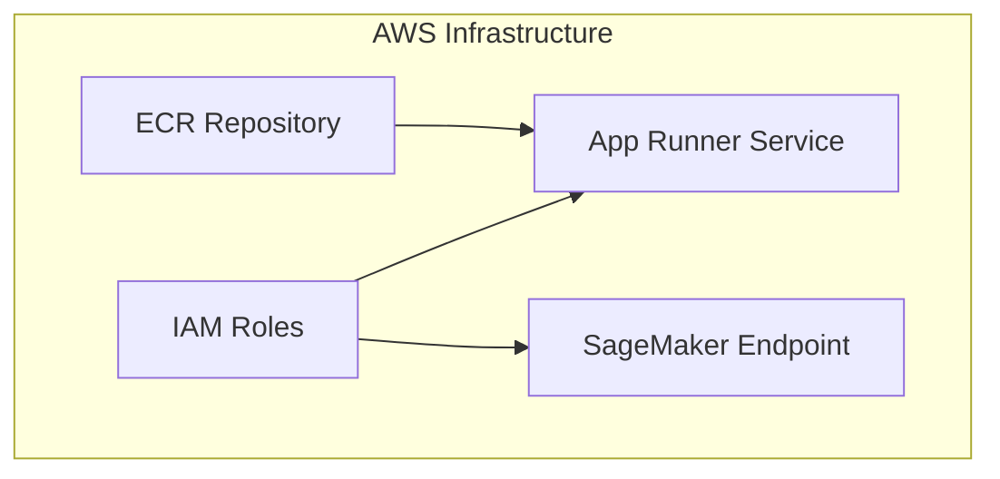

# AWS Setup

Complete guide to setting up AWS infrastructure for the Nigeria Tax Bill Chatbot.

## Prerequisites

- AWS Account with admin access
- AWS CLI installed and configured
- Docker installed (for local testing)

---

## Architecture Overview



---

## Step 1: Create IAM Roles

### SageMaker Execution Role

```bash
# Create trust policy
cat > trust-policy.json << 'EOF'
{
  "Version": "2012-10-17",
  "Statement": [
    {
      "Effect": "Allow",
      "Principal": {
        "Service": "sagemaker.amazonaws.com"
      },
      "Action": "sts:AssumeRole"
    }
  ]
}
EOF

# Create role
aws iam create-role \
  --role-name SageMakerExecutionRole \
  --assume-role-policy-document file://trust-policy.json

# Attach policies
aws iam attach-role-policy \
  --role-name SageMakerExecutionRole \
  --policy-arn arn:aws:iam::aws:policy/AmazonSageMakerFullAccess
```

### App Runner Service Role

```bash
# Create trust policy
cat > apprunner-trust.json << 'EOF'
{
  "Version": "2012-10-17",
  "Statement": [
    {
      "Effect": "Allow",
      "Principal": {
        "Service": "build.apprunner.amazonaws.com"
      },
      "Action": "sts:AssumeRole"
    }
  ]
}
EOF

# Create role
aws iam create-role \
  --role-name AppRunnerECRAccessRole \
  --assume-role-policy-document file://apprunner-trust.json

# Attach ECR access policy
aws iam attach-role-policy \
  --role-name AppRunnerECRAccessRole \
  --policy-arn arn:aws:iam::aws:policy/service-role/AWSAppRunnerServicePolicyForECRAccess
```

### Instance Role (for SageMaker invocation)

```bash
# Create policy for SageMaker invocation
cat > sagemaker-invoke-policy.json << 'EOF'
{
  "Version": "2012-10-17",
  "Statement": [
    {
      "Effect": "Allow",
      "Action": [
        "sagemaker:InvokeEndpoint",
        "sagemaker:DescribeEndpoint"
      ],
      "Resource": "arn:aws:sagemaker:*:*:endpoint/nigeria-tax-*"
    }
  ]
}
EOF

aws iam create-policy \
  --policy-name SageMakerInvokePolicy \
  --policy-document file://sagemaker-invoke-policy.json
```

---

## Step 2: Create ECR Repository

```bash
# Create repository
aws ecr create-repository \
  --repository-name nigeria-tax-chatbot \
  --image-scanning-configuration scanOnPush=true

# Get repository URI
aws ecr describe-repositories \
  --repository-names nigeria-tax-chatbot \
  --query 'repositories[0].repositoryUri' \
  --output text
```

---

## Step 3: Deploy SageMaker Endpoint

### Using the Deployment Script

```bash
python tools/deploy_with_autoscaling.py
```

### Manual Deployment

```python
import boto3
from sagemaker.huggingface import HuggingFaceModel

# Configuration
role_arn = "arn:aws:iam::YOUR_ACCOUNT:role/SageMakerExecutionRole"
model_id = "ocanthony4real/NigeriaTaxLlama-3.1-8B-RAG-v3"

# Create model
hub_config = {
    'HF_MODEL_ID': model_id,
    'HF_TOKEN': 'YOUR_HF_TOKEN',
    'SM_NUM_GPUS': '1'
}

model = HuggingFaceModel(
    env=hub_config,
    role=role_arn,
    transformers_version='4.37.0',
    pytorch_version='2.1.0',
    py_version='py310',
)

# Deploy
predictor = model.deploy(
    initial_instance_count=1,
    instance_type='ml.g5.xlarge',
    endpoint_name='nigeria-tax-llama-v3'
)
```

### Configure Auto-scaling

```python
import boto3

client = boto3.client('application-autoscaling')

# Register scalable target
client.register_scalable_target(
    ServiceNamespace='sagemaker',
    ResourceId='endpoint/nigeria-tax-llama-v3/variant/AllTraffic',
    ScalableDimension='sagemaker:variant:DesiredInstanceCount',
    MinCapacity=0,  # Scale to zero
    MaxCapacity=1
)

# Create scaling policy
client.put_scaling_policy(
    PolicyName='scale-to-zero',
    ServiceNamespace='sagemaker',
    ResourceId='endpoint/nigeria-tax-llama-v3/variant/AllTraffic',
    ScalableDimension='sagemaker:variant:DesiredInstanceCount',
    PolicyType='TargetTrackingScaling',
    TargetTrackingScalingPolicyConfiguration={
        'TargetValue': 1.0,
        'PredefinedMetricSpecification': {
            'PredefinedMetricType': 'SageMakerVariantInvocationsPerInstance'
        },
        'ScaleInCooldown': 900,  # 15 minutes
        'ScaleOutCooldown': 60
    }
)
```

---

## Step 4: Create App Runner Service

### Using AWS CLI

```bash
# Create service
aws apprunner create-service \
  --service-name nigeria-tax-chatbot \
  --source-configuration '{
    "ImageRepository": {
      "ImageIdentifier": "YOUR_ACCOUNT.dkr.ecr.us-east-1.amazonaws.com/nigeria-tax-chatbot:latest",
      "ImageRepositoryType": "ECR",
      "ImageConfiguration": {
        "Port": "8000",
        "RuntimeEnvironmentVariables": {
          "AWS_REGION": "us-east-1",
          "QDRANT_CLOUD_URL": "YOUR_QDRANT_URL",
          "QDRANT_APIKEY": "YOUR_QDRANT_KEY",
          "SAGEMAKER_ENDPOINT_INFERENCE": "nigeria-tax-llama-v3"
        }
      }
    },
    "AutoDeploymentsEnabled": true,
    "AuthenticationConfiguration": {
      "AccessRoleArn": "arn:aws:iam::YOUR_ACCOUNT:role/AppRunnerECRAccessRole"
    }
  }' \
  --instance-configuration '{
    "Cpu": "2 vCPU",
    "Memory": "4 GB"
  }' \
  --health-check-configuration '{
    "Protocol": "HTTP",
    "Path": "/api/health",
    "Interval": 10,
    "Timeout": 5,
    "HealthyThreshold": 1,
    "UnhealthyThreshold": 5
  }'
```

### Using Console

1. Go to AWS App Runner console
2. Click "Create service"
3. Select "Container registry" → "Amazon ECR"
4. Choose your repository and image tag
5. Configure:
   - Port: 8000
   - CPU: 2 vCPU
   - Memory: 4 GB
6. Add environment variables
7. Configure health check: `/api/health`
8. Create service

---

## Step 5: Configure Secrets

### Using AWS Secrets Manager

```bash
# Create secret
aws secretsmanager create-secret \
  --name nigeria-tax-chatbot/secrets \
  --secret-string '{
    "QDRANT_CLOUD_URL": "YOUR_URL",
    "QDRANT_APIKEY": "YOUR_KEY",
    "AWS_ACCESS_KEY": "YOUR_KEY",
    "AWS_SECRET_KEY": "YOUR_SECRET"
  }'
```

### Using Environment Variables

Set in App Runner service configuration:

```yaml
RuntimeEnvironmentVariables:
  AWS_REGION: us-east-1
  QDRANT_CLOUD_URL: https://xyz.qdrant.io
  QDRANT_APIKEY: your_api_key
  SAGEMAKER_ENDPOINT_INFERENCE: nigeria-tax-llama-v3
```

---

## Step 6: Set Up CI/CD

### GitHub Actions Secrets

Add these secrets to your GitHub repository:

| Secret | Description |
|--------|-------------|
| `AWS_ACCESS_KEY_ID` | IAM user access key |
| `AWS_SECRET_ACCESS_KEY` | IAM user secret key |
| `APPRUNNER_SERVICE_ARN` | App Runner service ARN |

### Workflow File

```yaml title=".github/workflows/docker-ecr.yml"
name: Build and Deploy

on:
  push:
    branches: [main]
    paths: ['web/**']

jobs:
  deploy:
    runs-on: ubuntu-latest
    steps:
      - uses: actions/checkout@v4

      - name: Configure AWS
        uses: aws-actions/configure-aws-credentials@v4
        with:
          aws-access-key-id: ${{ secrets.AWS_ACCESS_KEY_ID }}
          aws-secret-access-key: ${{ secrets.AWS_SECRET_ACCESS_KEY }}
          aws-region: us-east-1

      - name: Login to ECR
        id: login-ecr
        uses: aws-actions/amazon-ecr-login@v2

      - name: Build and push
        env:
          ECR_REGISTRY: ${{ steps.login-ecr.outputs.registry }}
          IMAGE_TAG: ${{ github.sha }}
        run: |
          docker build -t $ECR_REGISTRY/nigeria-tax-chatbot:$IMAGE_TAG -f web/Dockerfile web/
          docker push $ECR_REGISTRY/nigeria-tax-chatbot:$IMAGE_TAG
          docker tag $ECR_REGISTRY/nigeria-tax-chatbot:$IMAGE_TAG $ECR_REGISTRY/nigeria-tax-chatbot:latest
          docker push $ECR_REGISTRY/nigeria-tax-chatbot:latest

      - name: Deploy to App Runner
        run: |
          aws apprunner start-deployment \
            --service-arn ${{ secrets.APPRUNNER_SERVICE_ARN }}
```

---

## Verification

### Test SageMaker Endpoint

```python
import boto3
import json

client = boto3.client('sagemaker-runtime', region_name='us-east-1')

response = client.invoke_endpoint(
    EndpointName='nigeria-tax-llama-v3',
    ContentType='application/json',
    Body=json.dumps({
        "inputs": "What is VAT?",
        "parameters": {"max_new_tokens": 100}
    })
)

print(response['Body'].read().decode())
```

### Test App Runner

```bash
curl https://YOUR_SERVICE.us-east-1.awsapprunner.com/api/health
```

---

## Cost Estimation

| Service | Configuration | Est. Monthly Cost |
|---------|---------------|-------------------|
| SageMaker | ml.g5.xlarge, scale-to-zero | $0-150 |
| App Runner | 2 vCPU, 4GB, 1 instance | $50-80 |
| ECR | ~5GB storage | $1-5 |
| **Total** | | **$51-235** |

---

## Troubleshooting

??? question "SageMaker endpoint not responding"
    Check if the endpoint is scaled to zero:
    ```bash
    aws sagemaker describe-endpoint --endpoint-name nigeria-tax-llama-v3
    ```

??? question "App Runner deployment failed"
    Check build logs:
    ```bash
    aws apprunner list-operations --service-arn YOUR_SERVICE_ARN
    ```

??? question "ECR push permission denied"
    Ensure IAM user has ECR permissions:
    ```bash
    aws ecr get-login-password | docker login --username AWS --password-stdin YOUR_ACCOUNT.dkr.ecr.us-east-1.amazonaws.com
    ```

---

## Next Steps

- [Docker Guide](docker.md) - Container configuration
- [CI/CD Guide](cicd.md) - Automation setup
- [Cost Optimization](cost-optimization.md) - Reduce costs
