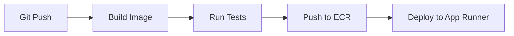
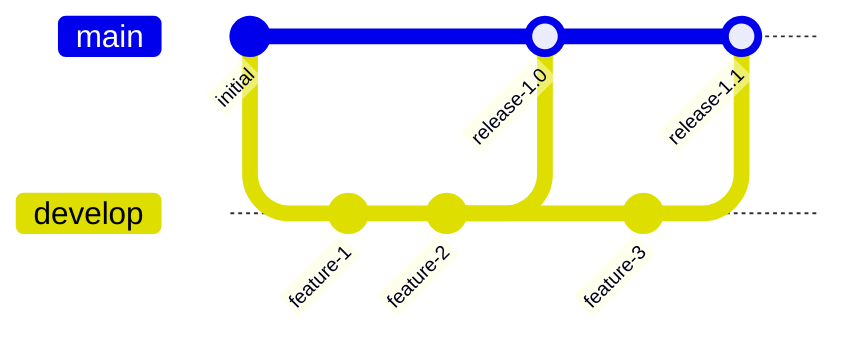

# CI/CD Guide

This guide covers the continuous integration and deployment pipeline for the Nigeria Tax Bill Chatbot.

## Overview

The project uses GitHub Actions for CI/CD with the following workflow:



---

## Workflow Files

### Docker Build and Deploy

```yaml title=".github/workflows/docker-ecr.yml"
name: Build and Deploy to AWS

on:
  push:
    branches: [main]
    paths:
      - 'web/**'
      - '.github/workflows/docker-ecr.yml'

  pull_request:
    branches: [main]
    paths:
      - 'web/**'

env:
  AWS_REGION: us-east-1
  ECR_REPOSITORY: nigeria-tax-chatbot

jobs:
  build-and-push:
    runs-on: ubuntu-latest

    steps:
      - name: Checkout code
        uses: actions/checkout@v4

      - name: Configure AWS credentials
        uses: aws-actions/configure-aws-credentials@v4
        with:
          aws-access-key-id: ${{ secrets.AWS_ACCESS_KEY_ID }}
          aws-secret-access-key: ${{ secrets.AWS_SECRET_ACCESS_KEY }}
          aws-region: ${{ env.AWS_REGION }}

      - name: Login to Amazon ECR
        id: login-ecr
        uses: aws-actions/amazon-ecr-login@v2

      - name: Set up Docker Buildx
        uses: docker/setup-buildx-action@v3

      - name: Build and push image
        uses: docker/build-push-action@v5
        with:
          context: ./web
          file: ./web/Dockerfile
          push: ${{ github.event_name != 'pull_request' }}
          tags: |
            ${{ steps.login-ecr.outputs.registry }}/${{ env.ECR_REPOSITORY }}:${{ github.sha }}
            ${{ steps.login-ecr.outputs.registry }}/${{ env.ECR_REPOSITORY }}:latest
          cache-from: type=gha
          cache-to: type=gha,mode=max

      - name: Deploy to App Runner
        if: github.event_name != 'pull_request'
        run: |
          aws apprunner start-deployment \
            --service-arn ${{ secrets.APPRUNNER_SERVICE_ARN }}

      - name: Wait for deployment
        if: github.event_name != 'pull_request'
        run: |
          echo "Waiting for deployment to complete..."
          sleep 60
          curl -f ${{ secrets.APP_URL }}/api/health || exit 1
```

### Continuous Integration

```yaml title=".github/workflows/ci.yaml"
name: Continuous Integration

on:
  push:
    branches: [main, develop]
  pull_request:
    branches: [main]

jobs:
  lint:
    runs-on: ubuntu-latest
    steps:
      - uses: actions/checkout@v4

      - name: Set up Python
        uses: actions/setup-python@v5
        with:
          python-version: '3.11'

      - name: Install dependencies
        run: |
          pip install ruff black mypy

      - name: Run Ruff
        run: ruff check .

      - name: Run Black
        run: black --check .

      - name: Run MyPy
        run: mypy llm_engineering --ignore-missing-imports

  test:
    runs-on: ubuntu-latest
    needs: lint
    steps:
      - uses: actions/checkout@v4

      - name: Set up Python
        uses: actions/setup-python@v5
        with:
          python-version: '3.11'

      - name: Install dependencies
        run: |
          pip install -r requirements.txt
          pip install pytest pytest-cov

      - name: Run tests
        run: |
          pytest tests/ --cov=llm_engineering --cov-report=xml

      - name: Upload coverage
        uses: codecov/codecov-action@v3
        with:
          files: coverage.xml

  build:
    runs-on: ubuntu-latest
    needs: test
    steps:
      - uses: actions/checkout@v4

      - name: Set up Docker Buildx
        uses: docker/setup-buildx-action@v3

      - name: Build image
        uses: docker/build-push-action@v5
        with:
          context: ./web
          push: false
          tags: nigeria-tax-chatbot:test
```

---

## GitHub Secrets

Configure these secrets in your repository settings:

| Secret | Description | Example |
|--------|-------------|---------|
| `AWS_ACCESS_KEY_ID` | IAM user access key | `AKIA...` |
| `AWS_SECRET_ACCESS_KEY` | IAM user secret key | `wJalr...` |
| `APPRUNNER_SERVICE_ARN` | App Runner service ARN | `arn:aws:apprunner:...` |
| `APP_URL` | Deployed app URL | `https://xyz.awsapprunner.com` |

### Setting Secrets

1. Go to repository **Settings**
2. Click **Secrets and variables** → **Actions**
3. Click **New repository secret**
4. Add each secret

---

## Branch Strategy



### Branch Rules

| Branch | Purpose | Deploy Target |
|--------|---------|---------------|
| `main` | Production | AWS App Runner |
| `develop` | Integration | None (CI only) |
| `feature/*` | Features | None (CI only) |

### Branch Protection

Enable these rules for `main`:

- [x] Require pull request before merging
- [x] Require status checks to pass
- [x] Require branches to be up to date

---

## Deployment Strategies

### Rolling Deployment (Default)

App Runner performs rolling deployments automatically:

1. New container version is pulled
2. New instances are started
3. Health checks pass
4. Traffic shifts to new instances
5. Old instances are terminated

### Blue-Green Deployment

For zero-downtime deploys with instant rollback:

```yaml
- name: Blue-Green Deploy
  run: |
    # Deploy to green environment
    aws apprunner create-service \
      --service-name nigeria-tax-chatbot-green \
      --source-configuration '...'

    # Wait for green to be healthy
    sleep 120

    # Swap DNS
    aws route53 change-resource-record-sets ...

    # Delete blue environment
    aws apprunner delete-service \
      --service-arn $BLUE_SERVICE_ARN
```

---

## Rollback Procedures

### Automatic Rollback

App Runner automatically rolls back if health checks fail.

### Manual Rollback

```bash
# List recent deployments
aws apprunner list-operations \
  --service-arn YOUR_SERVICE_ARN

# Rollback to previous image
aws apprunner update-service \
  --service-arn YOUR_SERVICE_ARN \
  --source-configuration '{
    "ImageRepository": {
      "ImageIdentifier": "YOUR_ACCOUNT.dkr.ecr.us-east-1.amazonaws.com/nigeria-tax-chatbot:PREVIOUS_TAG"
    }
  }'
```

---

## Monitoring Deployments

### GitHub Actions

View workflow runs at: `https://github.com/YOUR_REPO/actions`

### AWS Console

```bash
# Check deployment status
aws apprunner describe-service \
  --service-arn YOUR_SERVICE_ARN \
  --query 'Service.Status'

# View logs
aws logs tail /aws/apprunner/nigeria-tax-chatbot/service --follow
```

---

## Environment-Specific Configs

### Development

```yaml
- name: Deploy to Dev
  if: github.ref == 'refs/heads/develop'
  run: |
    # Deploy to dev environment
```

### Staging

```yaml
- name: Deploy to Staging
  if: startsWith(github.ref, 'refs/tags/v')
  run: |
    # Deploy to staging for testing
```

### Production

```yaml
- name: Deploy to Production
  if: github.ref == 'refs/heads/main'
  run: |
    # Deploy to production
```

---

## Notifications

### Slack Notification

```yaml
- name: Notify Slack
  if: always()
  uses: 8398a7/action-slack@v3
  with:
    status: ${{ job.status }}
    channel: '#deployments'
    webhook_url: ${{ secrets.SLACK_WEBHOOK }}
```

### Email Notification

```yaml
- name: Send email
  if: failure()
  uses: dawidd6/action-send-mail@v3
  with:
    server_address: smtp.gmail.com
    server_port: 587
    username: ${{ secrets.EMAIL_USERNAME }}
    password: ${{ secrets.EMAIL_PASSWORD }}
    subject: Deployment Failed
    to: team@example.com
```

---

## Troubleshooting

### View Workflow Logs

1. Go to **Actions** tab
2. Click on the failed workflow run
3. Expand the failed step

### Common Failures

??? question "ECR login failed"
    Check AWS credentials:
    ```bash
    aws sts get-caller-identity
    ```

??? question "Docker build failed"
    Build locally to debug:
    ```bash
    docker build -t test -f web/Dockerfile web/
    ```

??? question "App Runner deployment failed"
    Check service logs:
    ```bash
    aws apprunner describe-service --service-arn YOUR_ARN
    ```

---

## Next Steps

- [AWS Setup](aws-setup.md) - Infrastructure setup
- [Cost Optimization](cost-optimization.md) - Reduce costs
