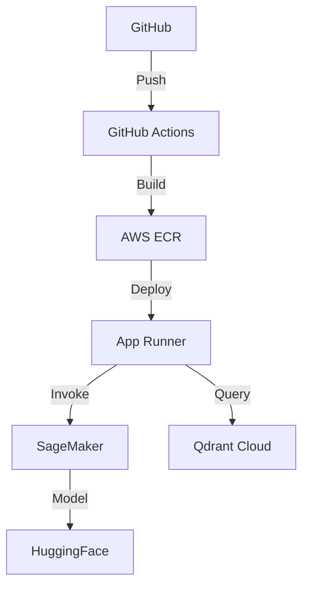

# Deployment

Deploy the Nigeria Tax Bill Chatbot to production.

---

## Deployment Options

<div class="grid cards" markdown>

-   :material-aws:{ .lg .middle } **AWS Setup**

    ---

    Complete AWS infrastructure setup with SageMaker and App Runner

    [:octicons-arrow-right-24: AWS Guide](aws-setup.md)

-   :material-docker:{ .lg .middle } **Docker**

    ---

    Container configuration and local Docker deployment

    [:octicons-arrow-right-24: Docker Guide](docker.md)

-   :material-github:{ .lg .middle } **CI/CD**

    ---

    GitHub Actions pipeline for automated deployments

    [:octicons-arrow-right-24: CI/CD Guide](cicd.md)

-   :material-currency-usd:{ .lg .middle } **Cost Optimization**

    ---

    Strategies to minimize infrastructure costs

    [:octicons-arrow-right-24: Cost Guide](cost-optimization.md)

</div>

---

## Architecture Overview



---

## Quick Deployment

### Using Docker

```bash
cd web
docker build -t nigeria-tax-chatbot .
docker run -p 8000:8000 --env-file .env nigeria-tax-chatbot
```

### Using GitHub Actions

1. Push to `main` branch
2. GitHub Actions builds and pushes to ECR
3. App Runner auto-deploys

---

## Cost Estimates

| Traffic | Monthly Cost |
|---------|--------------|
| Low (<100/day) | $55-105 |
| Medium (100-1000/day) | $145-185 |
| High (1000+/day) | $310-460 |
