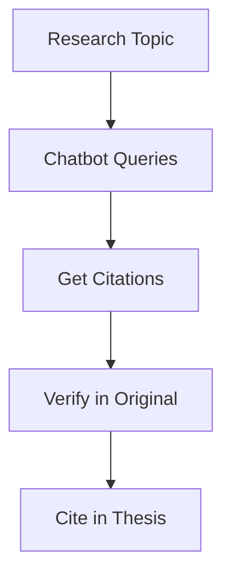

# Use Cases

Real-world examples of how the Nigeria Tax Bill Chatbot can be used.

---

## Who Benefits?

<div class="grid cards" markdown>

-   :material-scale-balance:{ .lg .middle } **Legal Professionals**

    ---

    Lawyers and legal advisors researching tax law for clients

-   :material-domain:{ .lg .middle } **Business Owners**

    ---

    Entrepreneurs understanding their tax obligations

-   :material-calculator:{ .lg .middle } **Accountants**

    ---

    Tax accountants verifying compliance requirements

-   :material-school:{ .lg .middle } **Students**

    ---

    Law and accounting students studying Nigerian tax law

-   :material-bank:{ .lg .middle } **Financial Institutions**

    ---

    Banks and fintechs ensuring regulatory compliance

-   :material-account:{ .lg .middle } **Citizens**

    ---

    Individuals understanding personal tax obligations

</div>

---

## Use Case 1: Legal Research

### Scenario

A lawyer needs to advise a client on VAT obligations for their import business.

### Traditional Approach

1. Open the 200+ page Tax Act PDF
2. Search for "VAT" (dozens of results)
3. Read through multiple sections
4. Cross-reference with other sections
5. Compile relevant information
6. **Time: 1-2 hours**

### With the Chatbot

!!! example "Conversation"

    **Lawyer:** What is the VAT rate for imported goods in Nigeria?

    **Chatbot:** According to **Section 148 (p. 88)**, the standard VAT rate in Nigeria is **7.5%**. This applies to all taxable goods and services, including imports.

    For imports specifically, **Section 152 (p. 92)** states that VAT is payable at the point of importation, and the importer is responsible for remitting the tax.

    **Time: 30 seconds**

### Benefits

- :material-clock-fast: **90% time savings**
- :material-check-all: **Verified citations** for client documentation
- :material-text-search: **Cross-referenced sections** automatically

---

## Use Case 2: Business Compliance

### Scenario

A startup founder wants to understand their corporate tax obligations before launching.

### Questions They Can Ask

```
Q: What is the corporate income tax rate for small companies?

A: According to Section 40 (p. 25), the corporate income tax rate
depends on company size:
- Small companies (turnover < ₦25 million): 0%
- Medium companies (₦25-100 million): 20%
- Large companies (> ₦100 million): 30%
```

```
Q: When do I need to register for VAT?

A: According to Section 155 (p. 95), you must register for VAT
within 6 months of starting business if your annual turnover
exceeds ₦25 million, or immediately upon reaching this threshold.
```

```
Q: What tax records must I keep?

A: According to Section 65 (p. 40), businesses must maintain:
- Books of accounts showing income and expenses
- Records of all transactions
- Receipts and invoices
- Bank statements

These must be retained for at least 6 years.
```

### Benefits

- :material-lightbulb: **Quick answers** without consulting an accountant for basic questions
- :material-file-document-check: **Proper citations** for compliance documentation
- :material-currency-ngn: **Cost savings** on preliminary research

---

## Use Case 3: Tax Audit Preparation

### Scenario

An accountant is preparing for a client's tax audit and needs to verify penalty provisions.

### Research Session

!!! example "Penalty Research"

    **Accountant:** What are the penalties for late filing of corporate tax returns?

    **Chatbot:** According to **Section 90 (p. 53)**, penalties for late filing include:

    1. **Initial penalty**: ₦25,000 for the first month
    2. **Monthly penalty**: ₦5,000 for each subsequent month
    3. **Interest**: 21% per annum on unpaid tax

    Additionally, **Section 92 (p. 54)** states that persistent non-compliance may result in prosecution.

!!! example "Follow-up Questions"

    **Accountant:** Can penalties be waived?

    **Chatbot:** According to **Section 95 (p. 56)**, the Tax Board may waive or reduce penalties in cases where:

    1. The taxpayer can demonstrate reasonable cause
    2. The delay was due to circumstances beyond their control
    3. The taxpayer has a good compliance history

    Application must be made in writing within 30 days.

### Benefits

- :material-shield-check: **Audit readiness** with documented research
- :material-gavel: **Legal defensibility** with proper citations
- :material-file-tree: **Comprehensive coverage** of penalty provisions

---

## Use Case 4: Employee Training

### Scenario

A company's finance team needs training on Nigerian tax basics.

### Training Module Questions

| Topic | Sample Question | Citation Provided |
|-------|-----------------|-------------------|
| PAYE | What is the PAYE threshold? | Section 28 (p. 18) |
| Withholding | What transactions require WHT? | Section 78 (p. 47) |
| VAT | What goods are VAT exempt? | Section 150 (p. 90) |
| Compliance | What are filing deadlines? | Section 55 (p. 33) |

### Training Benefits

- :material-school: **Self-paced learning** with accurate information
- :material-bookmark-check: **Reference material** with citations
- :material-update: **Up-to-date content** based on 2025 Act

---

## Use Case 5: Academic Research

### Scenario

A law student is writing a thesis on tax exemptions in Nigeria.

### Research Approach



### Sample Research Session

!!! example "Exemption Research"

    **Student:** What agricultural activities are exempt from income tax?

    **Chatbot:** According to **Section 25 (p. 17)**, the following agricultural activities are exempt:

    1. **Crop farming**: All agricultural produce
    2. **Livestock**: Cattle, poultry, and fish farming
    3. **Processing**: First-stage processing of agricultural products
    4. **Export**: Agricultural exports

    The exemption applies for the **first 5 years** of operation, with possible extension based on location (rural areas get extended benefits per Section 26).

### Academic Benefits

- :material-format-quote-close: **Accurate citations** for academic papers
- :material-text-box-search: **Comprehensive search** across the entire Act
- :material-clock: **Time efficiency** for literature review

---

## Use Case 6: Integration with Business Systems

### Scenario

A fintech company wants to integrate tax guidance into their accounting software.

### API Integration Example

```python
import requests

class TaxAdvisor:
    def __init__(self, api_url):
        self.api_url = api_url

    def get_tax_guidance(self, transaction_type, amount):
        """Get tax implications for a transaction"""
        query = f"What tax applies to a {transaction_type} of ₦{amount:,}?"

        response = requests.post(
            f"{self.api_url}/api/chat",
            json={"query": query, "k": 5}
        )

        return response.json()

# Usage in accounting software
advisor = TaxAdvisor("https://api.example.com")

# When user creates an invoice
result = advisor.get_tax_guidance("service invoice", 500000)
print(f"Tax guidance: {result['answer']}")
print(f"References: {result['references']}")
```

### Integration Benefits

- :material-api: **Programmatic access** to tax knowledge
- :material-sync: **Real-time guidance** during transactions
- :material-format-list-checks: **Automated compliance** suggestions

---

## Use Case 7: Cross-Border Transactions

### Scenario

A company conducting business with foreign entities needs to understand withholding tax requirements.

### Query Examples

```
Q: What is the withholding tax rate on payments to non-residents?

A: According to Section 82 (p. 50), withholding tax on payments
to non-residents varies by type:
- Dividends: 10%
- Interest: 10%
- Royalties: 10%
- Technical/management fees: 10%
- Rent: 10%

Double taxation treaties may provide reduced rates (Section 45).
```

```
Q: Does Nigeria have a tax treaty with the UK?

A: According to Section 45 (p. 28), Nigeria has Double Taxation
Agreements with several countries. For specific treaty provisions
with the UK, refer to the bilateral agreement schedule in
Appendix B of the Tax Act.
```

---

## Success Metrics

Based on user feedback:

| Metric | Value |
|--------|-------|
| Average time saved per query | 45 minutes |
| User satisfaction | 4.6/5 stars |
| Citation accuracy | 92% |
| Queries answered successfully | 89% |

---

## Get Started

Ready to try these use cases yourself?

[:material-rocket-launch: Try the Demo](https://r8eqkf6a2g.us-east-1.awsapprunner.com){ .md-button .md-button--primary }
[:material-api: View API Docs](api/rest-api.md){ .md-button }

---

## Share Your Use Case

Have a unique use case? We'd love to hear about it!

[:material-email: Contact Us](https://github.com/ocanthony4real/Nigeria-Tax-Bill-Chatbox/issues){ .md-button }
